# 🚀 TP — Orchestration de conteneurs avec Kubernetes
 
Ce document retrace les étapes réalisées lors du TP sur l'orchestration de conteneurs avec **Minikube** et **kubectl**.
 
---
 
## Objectifs
 
1. Installer et démarrer Minikube
2. Utiliser les commandes `kubectl`
3. Exposer un service Kubernetes vers l'extérieur
4. Scaler un déploiement
5. Réaliser un rolling update et un rollback
6. Déployer une application via des fichiers Manifest YAML
 
---
 
## 1. Installation et démarrage de Minikube
 
Après installation de Minikube, on démarre le cluster et on vérifie son état :
 
```bash
minikube start
minikube status
```
 
Le statut confirme que les composants `host`, `kubelet`, `apiserver` sont bien en état **Running**, et que `kubeconfig` est configuré. Minikube utilise ici le driver Docker sur Windows 11.
 
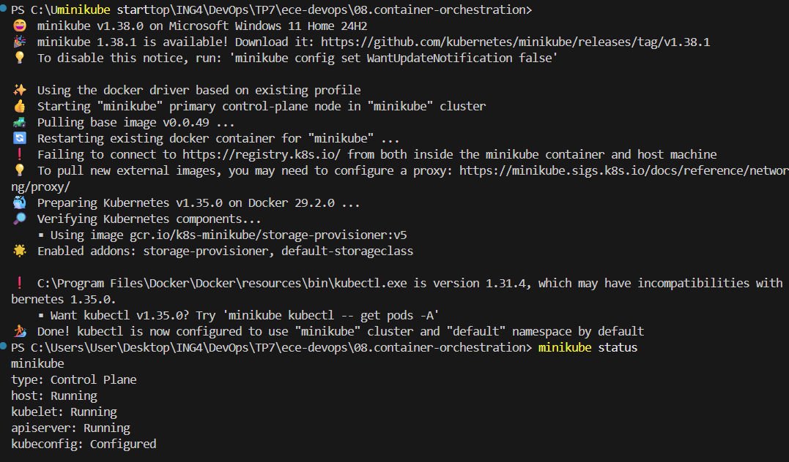
 
---
 
## 2. Utilisation des commandes `kubectl`
 
### Création du déploiement
 
```bash
kubectl create deployment kubernetes-bootcamp --image=gcr.io/google-samples/kubernetes-bootcamp:v1
```
 
On vérifie ensuite que le pod est bien en état `Running` :
 
```bash
kubectl get pods
```
 
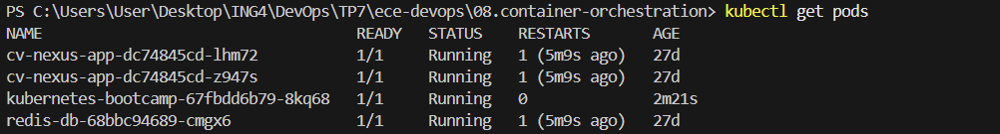
 
### Consultation des logs
 
```bash
kubectl logs $POD_NAME
```
 
Les logs indiquent que l'application Node.js a bien démarré.
 
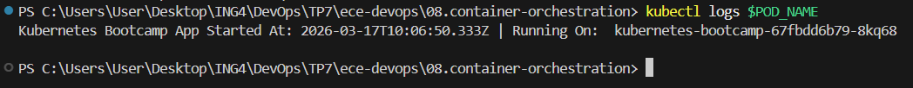
 
### Exploration du contenu du pod
 
On ouvre un shell dans le pod et on liste les fichiers présents à la racine :
 
```bash
kubectl exec -ti $POD_NAME -- bash
ls
```
 
Le fichier `server.js` est visible à la racine — c'est le code source de l'application web. On peut ensuite tester l'application depuis l'intérieur du conteneur avec `curl localhost:8080`.
 
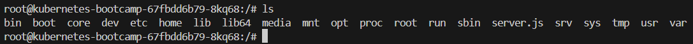
 
> **Note :** L'application ne répond pas encore depuis l'extérieur du pod, car aucun service n'est encore exposé.
 
---
 
## 3. Exposition du service vers l'extérieur
 
```bash
kubectl expose deployment kubernetes-bootcamp --type="NodePort" --port 8080
kubectl get services
```
 
Le service est créé en mode **NodePort**, mappé sur le port `31342` côté cluster.
 
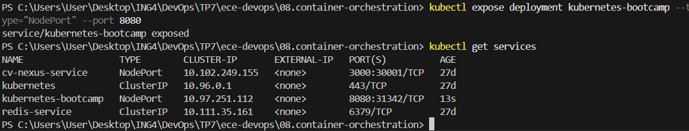
 
Comme Minikube utilise le driver Docker, on crée un tunnel pour accéder au service :
 
```bash
minikube service kubernetes-bootcamp
```
 
L'application est alors accessible depuis le navigateur :
 
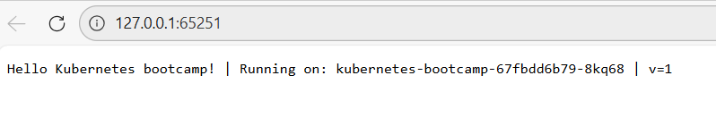
 
La réponse confirme : `Hello Kubernetes bootcamp! | Running on: kubernetes-bootcamp-67fbdd6b79-8kq68 | v=1`
 
---
 
## 4. Scaling du déploiement
 
### Scale up à 5 réplicas
 
```bash
kubectl scale deployments/kubernetes-bootcamp --replicas=5
kubectl get pods
```
 
Les 5 pods sont bien en état `Running`.
 
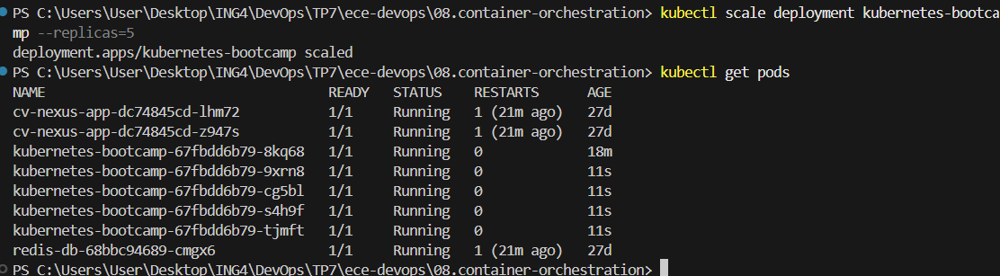
 
### Observation du Load Balancing
 
En actualisant la page plusieurs fois (ou via une boucle PowerShell), on constate que les requêtes sont distribuées sur différents pods :
 
```powershell
1..10 | ForEach-Object { (Invoke-WebRequest -Uri "http://127.0.0.1:51097" -DisableKeepAlive).Content; echo "" }
```
 
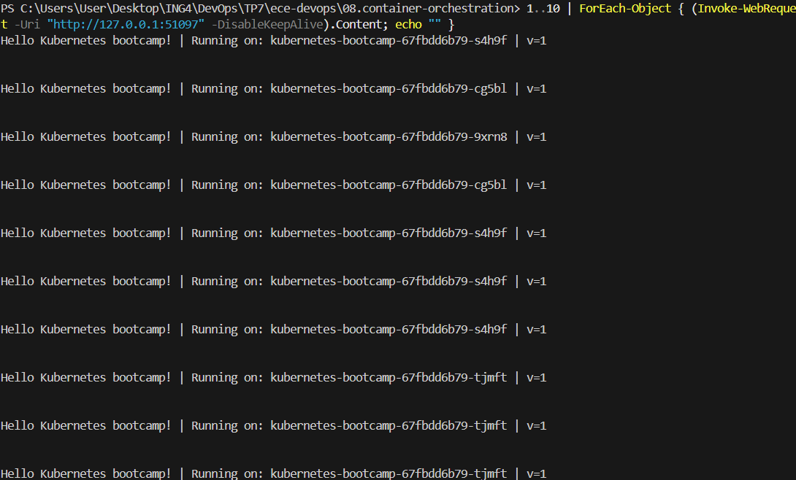
 
Chaque requête peut être traitée par un pod différent — c'est le **load balancing** natif de Kubernetes via son service.
 
### Scale down à 2 réplicas
 
```bash
kubectl scale deployments/kubernetes-bootcamp --replicas=2
```
 
---
 
## 5. Rolling Update & Rollback
 
### Mise à jour vers la v2
 
```bash
kubectl set image deployments/kubernetes-bootcamp kubernetes-bootcamp=jocatalin/kubernetes-bootcamp:v2
kubectl get pods
```
 
Pendant la transition, les anciens pods passent en `Terminating` tandis que les nouveaux démarrent.
 
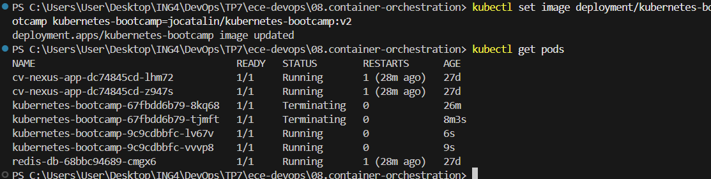
 
Une fois la mise à jour terminée, les requêtes retournent bien `v=2` :
 
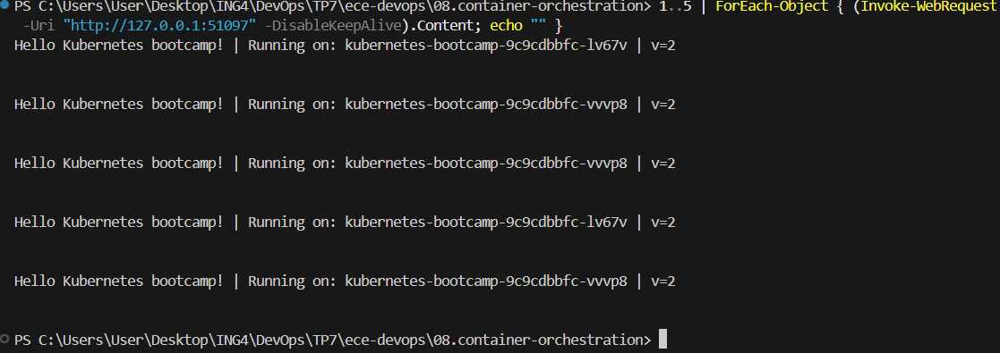
 
### Déploiement d'une image cassée (v3)
 
```bash
kubectl set image deployments/kubernetes-bootcamp kubernetes-bootcamp=jocatalin/kubernetes-bootcamp:v3
kubectl get pods
```
 
Le pod tente de démarrer mais échoue avec le statut **ErrImagePull** — l'image `v3` n'existe pas.
 
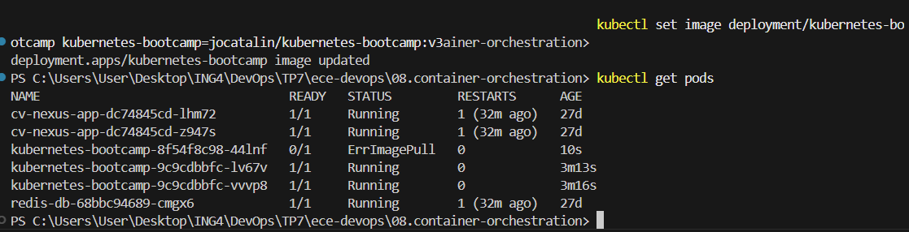
 
Kubernetes conserve les pods `v2` en vie grâce à sa stratégie de rolling update : **le service reste disponible**.
 
### Rollback vers la version stable
 
```bash
kubectl rollout undo deployments/kubernetes-bootcamp
kubectl get pods
```
 
Le rollback annule le déploiement défectueux et revient à la version `v2`.
 
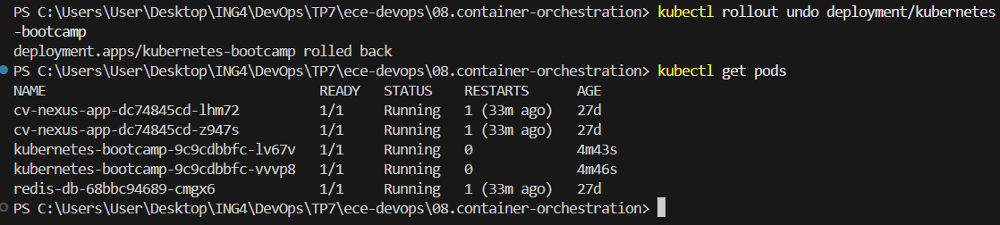
 
---
 
## 6. Déploiement via fichiers YAML
 
### Nettoyage préalable
 
```bash
kubectl delete service kubernetes-bootcamp
kubectl delete deployment kubernetes-bootcamp
```
 
### Application du fichier `deployment.yaml`
 
Le fichier `deployment.yaml` définit le déploiement de l'image `v1` avec 1 réplica. On l'applique avec :
 
```bash
kubectl apply -f lab/deployment.yaml
```
 
Puis on applique le service :
 
```bash
kubectl apply -f lab/service.yaml
```
 
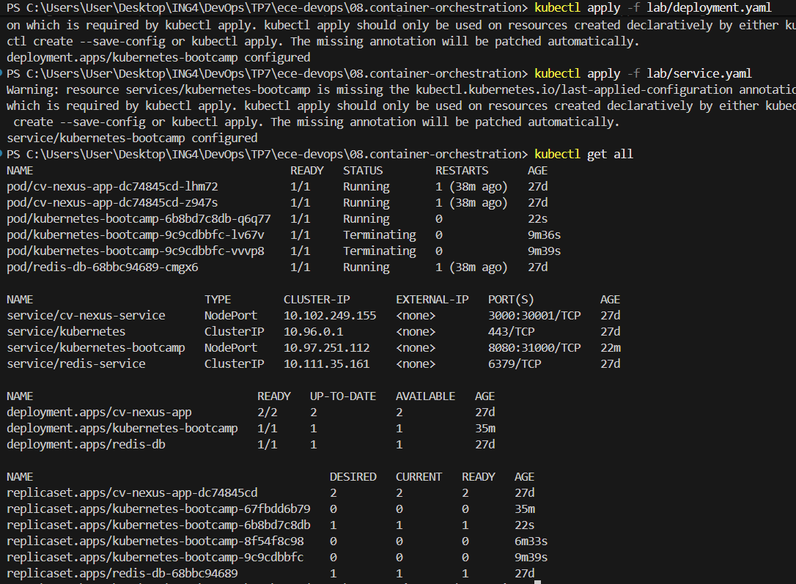
 
Le `kubectl get all` confirme que le déploiement, le service et le pod sont bien créés et actifs.
 
### Scaling via YAML (`replicas: 3`)
 
On modifie `deployment.yaml` pour passer à 3 réplicas (`TO COMPLETE #2`), puis on réapplique :
 
```bash
kubectl apply -f lab/deployment.yaml
kubectl get pods
```
 
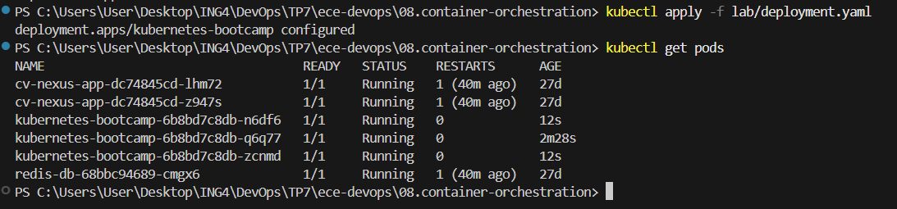
 
Les 3 pods `kubernetes-bootcamp` sont bien en état `Running`.
 
### Vérification finale dans le navigateur
 
En accédant à nouveau au service, on constate que les requêtes sont bien distribuées sur différents pods.
 
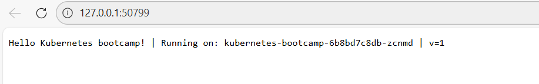
 
### Nettoyage final
 
```bash
kubectl delete service kubernetes-bootcamp
kubectl delete deployment kubernetes-bootcamp
minikube stop
```
 
---
 
## Récapitulatif des commandes clés
 
| Action | Commande |
|---|---|
| Démarrer Minikube | `minikube start` |
| Vérifier le statut | `minikube status` |
| Créer un déploiement | `kubectl create deployment ...` |
| Lister les pods | `kubectl get pods` |
| Voir les logs | `kubectl logs $POD_NAME` |
| Ouvrir un shell | `kubectl exec -ti $POD_NAME -- bash` |
| Exposer un service | `kubectl expose deployment ... --type=NodePort` |
| Accéder au service (Docker driver) | `minikube service $SERVICE_NAME` |
| Scaler | `kubectl scale deployments/... --replicas=N` |
| Mettre à jour l'image | `kubectl set image deployments/... ...` |
| Annuler un rollout | `kubectl rollout undo deployments/...` |
| Appliquer un YAML | `kubectl apply -f fichier.yaml` |
| Tout voir | `kubectl get all` |